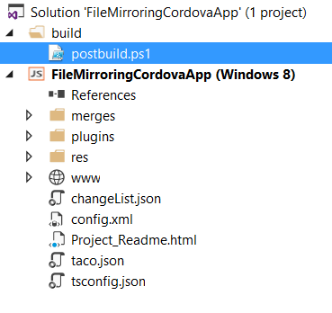
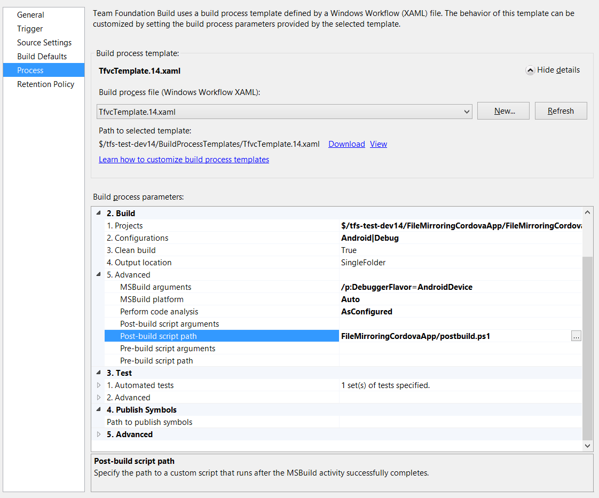
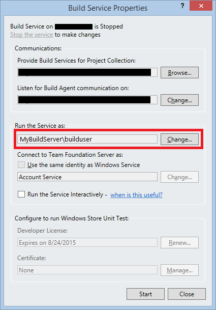

<properties pageTitle="Ionic Tutorial" 
  description="This is an article on ionic tutorial" 
  services="" 
  documentationCenter=""
  authors="bursteg" />

#Using Tools for Apache Cordova (RTM) with Team Foundation Services 2013
**This article is intended for use with Visual Studio 2015 RTM or later. See [this alternate tutorial](./RC/tfc2013.md) for details on using Visual Studio 2015 RC.** 

The article is part of a [series of tutorials](./tutorial-team-build-readme.md) on building Visual Studio 2015 Tools for Apache Cordova projects in a Team / CI environment.

##Background
Tools for Apache Cordova is designed to work with a number of different team build systems since the projects it creates are standard [Apache Cordova Command Line interface](http://go.microsoft.com/fwlink/?LinkID=533773) (CLI) projects. However, you have an existing Team Foundation Services 2013 installation and would like to use existing configured build agents.

It is important to note that as a general recommendation, we encourage the use of [TFS 2015's next generation cross-platform build system](./tfs2015.md) and [Gulp](../tutorial-gulp) based build capabilities rather than TFS 2013 or MSBuild since this provides the ability build directly from TFS on Windows or OSX. See the [TFS 2015 tutorial](http://go.microsoft.com/fwlink/?LinkID=533771) for details. Visual Studio Online's support for building Cordova apps will focus on the Gulp based TFS 2015 approach rather than MSBuild. 

This tutorial will describe how to configure TFS to build a Tools for Apache Cordova project using MSBuild and the steps provided here will generally apply to using MSBuild with TFS 2015 as well.

**Troubleshooting Tip:** Be aware that we recommend against adding the "platforms" folder or the following json files in the "plugins" folder into source control: android.json, ios.json, remote_ios.json, windows.json, and wp8.json. See "What to Add to Source Control" in the [general team build tutorial](./general.md#whattoadd) for additional details.

##Initial Setup
Before getting started with setting up your TFS Build Agent, you should install Visual Studio 2015 with the Tools for Apache Cordova option. You will also want to select the Windows / Windows Phone 8.1 tools and the Windows Phone 8.0 tools if you want to build for any of these platforms. From there you will want to configure a TFS build agent on the server you have installed Visual Studio 2015.

-   See [Tools for Apache Cordova documentation](http://go.microsoft.com/fwlink/?LinkID=533794) for setup details on Visual Studio 2015.
-   See [Team Foundation 2013 Build documentation](http://go.microsoft.com/fwlink/?LinkID=533786) for setup details on Team Foundation Services 2013.

**Troubleshooting Tip:** See ["Internet Access & Proxy Setup" in the general CI tutorial](./general.md#proxy) if your build servers have limited Internet connectivity or require routing traffic through a proxy.

##Common Build Definition Parameters & Environment Variables
###Updated Build Process Template
Before you get started, it's important to note that you will need to use v14 of MSBuild when building a Tools for Apache Cordova project. Build definition templates that ship with TFS 2013 support v11 and v12. As a result, you will need to create a modified TFS Build Process Template for TFS to use MSBuild v14.0. To do this, you can simply download the TfvcTemplate.12.xaml MSBuild v12 template (or your own custom one) and append ToolVersion="14.0" to the end of the **RunMSBuild** element and upload it as a new template. Ex:

~~~~~~~~~~~~~~~~~~~~~~~~~~~~~~~~~~~~~~~~~~~~~~~~~~~~~~~~~~~~~~~~~~~~~~~~~~~~~~~~
<mtba:RunMSBuild ToolVersion="14.0" DisplayName="Run MSBuild" OutputLocation="[OutputLocation]" CleanBuild="[CleanBuild]" CommandLineArguments="[String.Format(&quot;/p:SkipInvalidConfigurations=true {0}&quot;, AdvancedBuildSettings.GetValue(Of String)(&quot;MSBuildArguments&quot;, String.Empty))]" ConfigurationsToBuild="[ConfigurationsToBuild]" ProjectsToBuild="[ProjectsToBuild]" ToolPlatform="[AdvancedBuildSettings.GetValue(Of String)(&quot;MSBuildPlatform&quot;, &quot;Auto&quot;)]" RunCodeAnalysis="[AdvancedBuildSettings.GetValue(Of String)(&quot;RunCodeAnalysis&quot;, &quot;AsConfigured&quot;)]" />
~~~~~~~~~~~~~~~~~~~~~~~~~~~~~~~~~~~~~~~~~~~~~~~~~~~~~~~~~~~~~~~~~~~~~~~~~~~~~~~~

See [TFS 2013 documentation](http://go.microsoft.com/fwlink/?LinkID=533787) for additional information on modifying build process templates.

You can then [create a build definition](http://go.microsoft.com/fwlink/?LinkID=533788) for your project and select this updated template.

###Getting Resulting Packages to Land in the Drop Folder

To get the resulting packages from the Cordova build process to land in the configured TFS drop folder, you will need to add in a simple post-build PowerShell script to your project.

First, create a PowerShell script called postbuild.ps1 in your project under a solution folder that contains the following script:

~~~~~~~~~~~~~~~~~~~~~~~~~~~~~~~~~~~~~~~~~~~~~~~~~~~~~~~~~~~~~~~~~~~~~~~~~~~~~~~~
$packages = gci $Env:TF_BUILD_SOURCESDIRECTORY -recurse -include $("bin") | ?{ $_.PSIsContainer } | foreach { gci -Path $_.FullName -Recurse -include $("*.apk", "*.ipa", "*.plist", "*.xap") }
foreach ($file in $packages) {
	Copy $file $Env:TF_BUILD_BINARIESDIRECTORY
}
gci $Env:TF_BUILD_SOURCESDIRECTORY -recurse -include $("AppPackages") | ?{ $_.PSIsContainer } | Copy -Destination $Env:TF_BUILD_BINARIESDIRECTORY –Recurse -Force 
~~~~~~~~~~~~~~~~~~~~~~~~~~~~~~~~~~~~~~~~~~~~~~~~~~~~~~~~~~~~~~~~~~~~~~~~~~~~~~~~

This will copy any .apk, .ipa, or .plist file from the project's "bin" folder to the drop location and will also grab generated AppPackages under the platforms/windows/AppPackages folder from your project. Place this script under a solution folder such as "build".

Now, create a build definition if you have not done so already and add the PowerShell script as a post-build script under "Process =\> Build =\> Advanced =\> Post-build script path". The file will be under the solution so you will need include the solution folder name in the path. You will also want to ensure your build definition with the output location (Process =\> Build =\> 4. Output location) as "SingleFolder" rather than AsConfigured.

##Common Environment Variables
There are a set of environment variables that need to be made available to MSBuild. These can either be setup on your machine as system environment variables or using the "/p" option in your build definition (Process =\> Advanced =\> MSBuild Arguments).

**Troubleshooting Tip:** Use full, absolute paths and be sure to remove any leading or trailing spaces in your variable paths! Also note that whenever you set a system environment variable you will need to restart the build service to get it to pick up the change.

| **Variable**      | **Required For**                   | **Purpose**                              | **Default Location (Visual Studio 2015)**          |
|:------------------|:-----------------------------------|:-----------------------------------------|:---------------------------------------------------|
| **MDAVSIXDIR**    | Any operation                      | Location of the Tools for Apache Cordova VSIX. With Visual Studio 2015, its location is always the same. In VS 2013, you will need to search for the VSIX by finding a folder containing the "vs-mda-targets" folder.   | C:\\Program Files (x86)\\Microsoft Visual Studio 14.0\\Common7\\IDE\\Extensions\\ApacheCordovaTools |
| **NODEJSDIR**     | Any operation                      | Location of Node.js                      | C:\\Program Files (x86)\\nodejs |
| **NPMINSTALLDIR** | Any operation                      | Location to install npm packages when building. | C:\\Users\your-user-here\\AppData\Roaming\\npm |
| **LANGNAME**      | Any operation                      | Language used for VS generated Cordova build messages. | en-us |
| **BUILDVERBOSITY**| Any operation                      | Logging level for the Node.js portion of the build.   Set using the /p MSBuild argument in your build definition (Process =\> Advanced =\> MSBuild Arguments). | Normal |
| **GIT\_HOME**     | Optional: Plugins Acquired via Git | Location of the Git Command Line Tools | C:\\Program Files (x86)\\git |
| **GRADLE\_USER\_HOME**      | Optional | Overrides the default location Gradle build system dependencies should be installed when building Android using Cordova 5.0.0+ | If not specified, uses %HOME%\\.gradle |

## Building Android

If you have not already, create a build definition for your project. Note that currently you'll will need a separate build definition for each device platform you intend to target.

###Android Environment Variables

In addition to the common environment variables mentioned above, the following variables can either be set as system environment variables or semi-colon delimited using the "/p" option in your build definition (Process =\> Advanced =\> MSBuild Arguments).

**Note that whenever you set a system environment variable you will need to restart the build service to get it to pick up the change.**

| **Variable**      | **Required For** | **Purpose**                 | **Default Location (Visual Studio 2015)** |
|:------------------|:-----------------|:----------------------------|:------------------------------------------|
| **ANT\_HOME**     | Android in Cordova < 5.0.0  | Location of Ant             | C:\\Program Files (x86)\\Microsoft Visual Studio 14.0\\Apps\\apache-ant-1.9.3 |
| **ANDROID\_HOME** | Android          | Location of the Android SDK | C:\\Program Files (x86)\\Android\\android-sdk |
| **JAVA\_HOME**    | Android          | Location of Java            | C:\\Program Files (x86)\\Java\\jdk1.7.0\_55 |

##Android Build Definition Settings

In addition to your other build definition settings, you will want to use the following build parameter values.

| **Parameter**                            | **Purpose**                              | **Value**                                |
|:-----------------------------------------|:-----------------------------------------|:-----------------------------------------|
| **Process =\> Items To Build =\> Configurations to Build**| Platform to build| **Configuration: Debug or Release**   **Platform: Android** |
| **Process =\> Advanced =\> MSBuild Arguments** | Indicates the type of build to create: emulator, ripple, or device. | **/p:DebuggerFlavor=AndroidDevice** |
 
##Building iOS
Building for iOS with TFS 2013 requires that a TFS agent running on Windows be configured to communicate with a Visual Studio remote build agent running on OSX. See [the remote agent section](http://go.microsoft.com/fwlink/?LinkID=533745) of the Tools for Apache Cordova installation documentation for details on setting up the remote agent on OSX. 

**Note that Visual Studio 2015 RTM uses a different remote agent package (remoteagent)** than the vs-mda-remote agent used in VS 2015 RC and below.

If you have not already, create a build definition for your project. Note that currently you'll will need a separate build definition for each device platform you intend to target.

**Troubleshooting Tip:** See ["Troubleshooting Tips for Building on OSX" in the general CI tutorial](./general.md#osxgotcha) for tips on resolving common build errors that can occur when building Cordova projects on that operating system.

###iOS Environment Variables and Cert Setup
In addition to the common environment variables mentioned above, the following variables can either be set as system environment variables or semi-colon delimited using the "/p" option in your build definition (Process =\> Advanced =\> MSBuild Arguments).

For iOS, using a system environment variable is most useful when you want a single iOS build definition to built on a number of separate Windows TFS based build agents with a set of different OSX remote build agents instances in your build farm.

|**Variable**             | **Required For** | **Purpose**                              | **Example**                              |
|:-------------------------|:-----------------|:-----------------------------------------|:-----------------------------------------|
| **iOSRemoteSecureBuild** | iOS | Indicates whether a secure connection should be used to connect to the agent | true |
| **iOSRemoteBuildServer** | iOS | URI of the iOS remote agent. Form:   http(s)://&lt;host&gt;:&lt;port&gt;/cordova   Use "https" in secure mode. | https://chux-mini.local:3000/cordova |
| **iOSCertificateName** | iOS | Name of the SSL certificate for secure mode. Form:   remotebuild.&lt;host&gt; | remotebuild.chux-mini.local |

###Importing the Secure Connection SSL Certificate

By far the easiest way to import the client SSL certificate used for secure remote build is to simply start up Visual Studio and configure the remote agent there. This will import the client SSL cert into your local certificate store so it can be used during build. See [Tools for Apache Cordova documentation](http://go.microsoft.com/fwlink/?LinkID=533745) for details.

**Note: You also need to configure the TFS build service on your build server to run using the same user that you used to log in and configure Visual Studio.**

#### (Optional) Manual Import of SSL Cert
However, it is also possible to manually import the SSL cert by following these steps:

1.  Generate a security PIN. This automatically occurs the first time you start up the remote build agent but you can also generate a new one using the following command:
	~~~~~~~~~~~~~~~~~~~~~~~~~~~~~~~~~~~~~~~~~~~~~~~~~~~~~~~~~~~~~~~~~~~~~~~~~~~~~~~~
	remoteagent generateClientCert
	~~~~~~~~~~~~~~~~~~~~~~~~~~~~~~~~~~~~~~~~~~~~~~~~~~~~~~~~~~~~~~~~~~~~~~~~~~~~~~~~

2.  Get the generated .p12 file from the agent using the following URI in a browser using substituting host, port, and PIN from the agent output. 

	~~~~~~~~~~~~~~~~~~~~~~~~~~~~~~~~~~~~~~~~~~~~~~~~~~~~~~~~~~~~~~~~~~~~~~~~~~~~~~~~
	https://<host>:<port>/certs/<pin>
	~~~~~~~~~~~~~~~~~~~~~~~~~~~~~~~~~~~~~~~~~~~~~~~~~~~~~~~~~~~~~~~~~~~~~~~~~~~~~~~~

	Be sure you start the remote agent if it is not running before accessing this URI.

3.  Ignore the SSL security warning that may appear and download the .p12 file and save it. **Note: For security reasons, this PIN will be automatically invalidated after you download the file.** You may, however, use the cert file on multiple machines if needed.

6.  You now simply open the p12 file from the file system to import the cert using into your user's certificate store by accepting all the defaults in the Certificate Import Wizard that appears.

###iOS Build Definition Settings

In addition to your other build definition settings, you will want to use the following build parameter values.

| **Parameter**                            | **Purpose**                              | **Value**                                |
|:-----------------------------------------|:-----------------------------------------|:-----------------------------------------|
| **Process =\> Items To Build =\> Configurations to Build** | Platform to build                        | **Configuration: Debug or Release**   **Platform: iOS** |
| **Process =\> Advanced =\> MSBuild Arguments** | Indicates the type of build to create: simulator, ripple, or device.  | **/p:DebuggerFlavor=iOSLocalDevice** |

##Building Windows / Windows Phone 8.1
If you have not already, create a build definition for your project. Note that currently you'll will need a separate build definition for each device platform you intend to target.

###Windows 8.1 / 10 Build Definition Settings
In addition to your other build definition settings, you will want to use the following build parameter values.

| **Parameter**                            | **Purpose**                              | **Value**                                |
|:-----------------------------------------|:-----------------------------------------|:-----------------------------------------|
| **Process =\> Items To Build =\> Configurations to Build** | Platform to build | **Configuration: Debug or Release**   **Platform: One or more of the following depending on the chipsets you need to support:**   Windows-AnyCPU   Windows-ARM   Windows-x64   Windows-x86 |
| **Process =\> Advanced =\> MSBuild Arguments** | Indicates the type of build to create: simulator or device.  | **/p:DebuggerFlavor=WindowsLocal**       |

###Windows Phone 8.1 Build Definition Settings
In addition to your other build definition settings, you will want to use the following build parameter values.

| **Parameter**                            | **Purpose**                              | **Value**                                |
|:-----------------------------------------|:-----------------------------------------|:-----------------------------------------|
| **Process =\> Items To Build =\> Configurations to Build** | Platform to build | **Configuration: Debug or Release**   **Platform: Windows Phone (Universal)** |
| **Process =\> Advanced =\> MSBuild Arguments** | Indicates the type of build to create: emulator or device.  | **/p:DebuggerFlavor=AppHostLocalDebugger** |

##Building Windows Phone 8.0
If you have not already, create a build definition for your project. Note that currently you'll will need a separate build definition for each device platform you intend to target.

###Build Definition Settings
In addition to your other build definition settings, you will want to use the following build parameter values.

| **Parameter**                            | **Purpose**                              | **Value**                                |
|:-----------------------------------------|:-----------------------------------------|:-----------------------------------------|
| **Process =\> Items To Build =\> Configurations to Build** | Platform to build | **Configuration: Debug or Release**   **Platform: Windows Phone 8** |
| **Process =\> Advanced =\> MSBuild Arguments** | Indicates the type of build to create: emulator or device.  | **/p:DebuggerFlavor=PhoneDevice** |

## More Information
* [Learn about other Team Build / CI options](./tutorial-team-build-readme.md)
* [Read tutorials and learn about tips, tricks, and known issues](../cordova-docs-readme.md)
* [Download samples from our Cordova Samples repository](http://github.com/Microsoft/cordova-samples)
* [Follow us on Twitter](https://twitter.com/VSCordovaTools)
* [Visit our site http://aka.ms/cordova](http://aka.ms/cordova)
* [Read MSDN docs on using Visual Studio Tools for Apache Cordova](http://go.microsoft.com/fwlink/?LinkID=533794)
* [Ask for help on StackOverflow](http://stackoverflow.com/questions/tagged/visual-studio-cordova)
* [Email us your questions](mailto:/vscordovatools@microsoft.com)
